# ROI Report — The Governed AI Pipeline

*What the pipeline cost to build, what it saves, and how much of that number I'd actually
defend in front of an engineering director.*

**Honesty note, up front.** Two kinds of numbers appear below and they are labelled everywhere:

- 📏 **Measured** — read off the audit log of a real `/ship` run (`.claude/audit/audit.jsonl`,
  session `<SHIP-SESSION>`) and real test runs. These are timestamps, not recollections.
- 📐 **Estimated** — the manual baseline for the *same* task, itemised from the step timings in
  [`workflow-map.md`](workflow-map.md) and from doing this work by hand before the pipeline existed.
  I did not re-do the task by hand with a stopwatch, so every baseline figure is an estimate and
  is marked as one. Where an assumption could flatter the result, I take the conservative side.

---

## The task that was measured

A real change, shipped through the real pipeline: **teach the Bash guard to block
`git reset --hard` and `git clean -f`** (destructive *local* git commands — the guard already
covered the remote-history case, `git push --force`). Source change staged, nothing else.

Shipped as [PR #1](https://github.com/wangshasha111/governed-ai-pipeline/pull/1) — merged.

## Before / after, step by step

| Step | Manual 📐 *(est.)* | `/ship` 📏 *(measured)* | Saved | What the measured number covers |
|---|---:|---:|---:|---|
| **Review** the staged diff | 10 min | **1.6 min** | 8.4 | `/review` read the diff against `CLAUDE.md`, found no Blocker/Major, cleared the gate |
| **Test**: write + run tests | 30 min | **1.3 min** | 28.7 | `/test-gen` wrote **9 new cases**, ran the suite (41 → **50 passed**) |
| **Commit**: changelog + message | 8 min | **0.8 min** | 7.2 | Conventional-Commits message from the diff; also created `docs/CHANGELOG.md` |
| **PR**: push + title + body | 7 min | **2.3 min** | 4.7 | `git push`, `gh pr create`, PR body with test results and reviewer notes |
| **Total** | **55 min** 📐 | **7 min** 📏 | **48 min** | 6.3 min of audited tool activity; 7 min wall-clock including my approvals |

**Speedup: ≈ 7.9×** on this task. (📏 numerator, 📐 denominator — so treat it as "roughly 8×",
not 7.9 exactly.)

Two of the four stages hit a guard mid-run and had to route around it (see *Friction*, below).
**That friction is inside the 7 minutes** — this is the messy real number, not a clean-room one.

## Where the time went

```mermaid
gantt
    title /ship — audited timeline (session <SHIP-SESSION>, 17:13–17:19 UTC)
    dateFormat HH:mm:ss
    axisFormat %M:%S
    section Review
    read diff + CLAUDE.md, verdict     :a1, 17:13:14, 96s
    section Test-gen
    run suite, write 9 cases, re-run   :a2, 17:14:56, 76s
    section Commit
    changelog + message                :a3, 17:16:12, 20s
    🚫 blocked by validate-bash        :crit, a4, 17:16:28, 25s
    commit via -F file                 :a5, 17:16:57, 18s
    section PR
    git push                           :a6, 17:17:15, 11s
    🚫 blocked by validate-bash        :crit, a7, 17:17:26, 18s
    pr create via --body-file          :a8, 17:17:44, 107s
```



## Weekly and annual projection

**Assumption (📐, deliberately conservative):** a developer ships **4 changes of this size per
week**. The workflow map says changes are a daily event, so 4/week is already below what the
map implies — I'd rather under-claim.

```
Saved per shipped change      = 55 min (manual, est.) − 7 min (measured) = 48 min
Per developer, per week       = 48 min × 4 changes                       = 192 min = 3.2 h
Per developer, per year       = 3.2 h × 46 working weeks                 = 147 h
10-person team, per year      = 147 h × 10                               = 1,472 h
At $150/hr                    = 1,472 h × $150                           ≈ $220,800 / year
```

*(46 weeks, not 52 — leave, holidays and the weeks where nobody ships.)*

### The number I'd actually defend

**$220,800 is the headline; ~$110,000 is the number I'd put in the business case.**

The headline assumes every saved minute converts into other productive work, which is not how
engineering time behaves. Halve it for that, and the claim becomes: *the pipeline pays for
roughly one additional engineer's worth of output per year across a 10-person team, and it cost
one engineer one day to build.* Even at a 75% haircut it clears its own cost by two orders of
magnitude. The load-bearing input is the 48-min saving per change — that is where scrutiny
belongs, and it is the one figure that is half-estimated.

## Quality — the part the time numbers miss

| | Before | After | Evidence |
|---|---|---|---|
| **Tests on the guards** | 0 | **50 passing** | `pytest tests -q` |
| **Coverage of the Python guards** | 0% | **89%** (`validate-bash.py` 89%, `check-secrets.py` 89%) | `pytest --cov` |
| **Review thoroughness** | Self-review, tired, at the end of the day | Every staged diff checked against every `CLAUDE.md` convention, every time | `/review` gate in `/ship` |
| **Changelog discipline** | Remembered, or not | Written by `/commit` as part of the commit | `docs/CHANGELOG.md` |
| **Bugs caught before merge** | — | **1 real regex bug** | see below |

That last row is the one I care about most. While writing tests for the new `git clean` pattern,
`/test-gen` found that keying the rule on `-d` made it **misfire on the `-d` inside `--dry-run`** —
`git clean --dry-run` would have been blocked, and `git clean -f` (no `-d`) would have been let
through. Both directions wrong. The pattern was fixed to key on the force flag before the change
ever reached `main`. Writing tests for a 5-line change found a bug in the 5-line change; the
manual baseline for this task almost certainly ships that bug.

## Friction — what the guards cost me during the run 📏

The `/ship` run was blocked **twice by my own guards, and both were false positives**:

1. `git commit -F -` with a heredoc whose *message body* quoted `git push --force` → blocked.
2. `gh pr create --title "...git reset --hard..."` → blocked by the very rule being shipped.

Neither command would have executed anything dangerous; both merely *contained the words*.
Root cause: `validate-bash` regexes the whole shell string and cannot distinguish the command
being run from text quoted inside it. The response was **not** to disable the hook or reword the
truth — the commit message and PR body were written to files and passed with `-F` / `--body-file`,
so the executed command was genuinely clean and the guard stayed on. The limitation is filed as a
known issue on PR #1: *strip heredoc bodies and quoted strings before matching.*

Cost: ~45 s of the 7 min. Worth it — but it is exactly the kind of false positive that erodes
trust if it goes unfixed, which is why [`governance-playbook.md`](governance-playbook.md) puts a
**dry-run week** before enforcement for the whole team.

## Governance controls deployed

| Control | Type | Event | Effect |
|---|---|---|---|
| `validate-bash.py` | Guard | PreToolUse (`Bash`) | **Denies** force+recursive delete, `DROP TABLE`, force push, `git reset --hard`, `git clean -f`, `mkfs`, `dd` to raw device, fork bombs, `curl \| sh`, `chmod -R 777` |
| `check-secrets.py` | Guard | PreToolUse (`Write\|Edit\|MultiEdit`) | **Denies** writes containing AWS/GitHub/Slack/Google/OpenAI keys, PEM private keys, hardcoded credentials — allows env references |
| `scope-guard.sh` | Guard | PreToolUse (`Write\|Edit\|MultiEdit`) | **Denies** in-repo writes outside `src app docs tests scripts .claude`, including `../` escapes |
| `audit-log.sh` | Logging | PostToolUse (`*`) | One JSON line per executed action |
| `log-prompt.sh` | Logging | UserPromptSubmit | Every prompt |
| `session-report.sh` | Logging | Stop | Per-session summary (actions / blocks / errors) |
| `permissions.deny` | Gate | — | Coarse denylist, independent of the hooks |
| `permissions.allow` | Gate | — | Read-only + routine dev commands run without a prompt |
| `defaultMode: "default"` | Gate | — | Everything else stops for a human |

**Blocks recorded to date: 5** — 3 in the guardrail demo (one per guard), 2 during the real
`/ship` run. All 5 are in `.claude/audit/audit.jsonl`.

## What this cost

Roughly one engineer-day to build and test the whole `.claude/` directory, and it is portable:
the next repo pays close to zero. Against ~1,472 hours/year of projected team saving, the build
cost is not the interesting part of the equation — the honesty of the 48-minute figure is.
