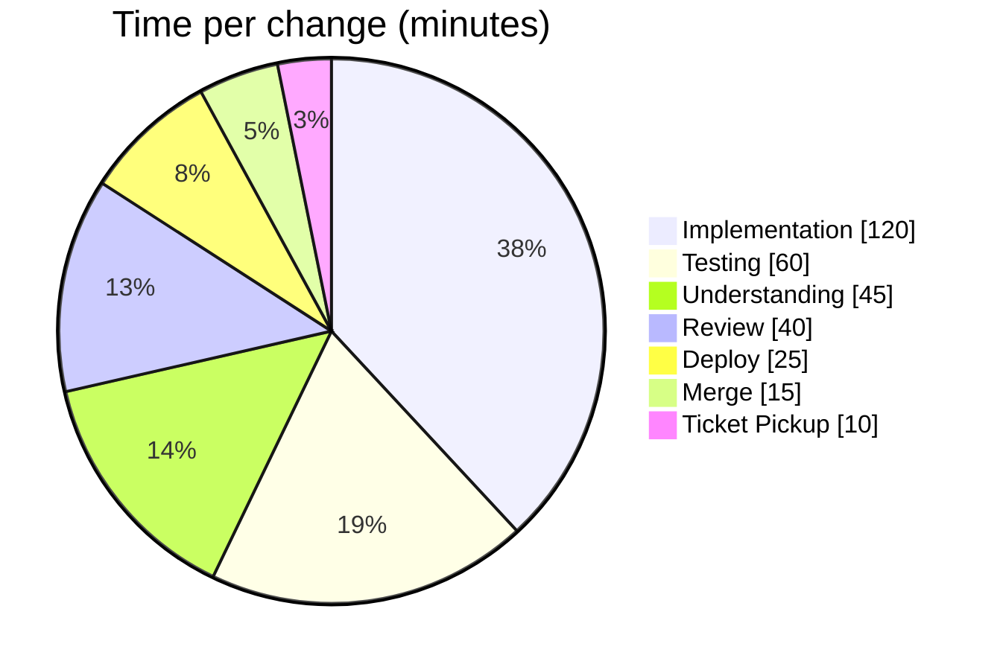

# Developer Workflow Map

*A single developer's end-to-end path for one non-trivial change (feature or bug fix) in the
target application: a Python/FastAPI backend that runs a multi-step LLM pipeline over uploaded
documents, plus a TypeScript SPA frontend. The domain logic is split across several parallel
**domain modules** that share a common computation core — which is where most of the pain in
this map comes from.*

> The target application's source code is not included in this repository (corporate policy).
> The workflow below, and every time figure in it, is from the real project this governance
> pipeline was built for and tested against.

This map is the input to [`leverage-analysis.md`](leverage-analysis.md), which scores each step
for automation ROI.

## The flow

```mermaid
flowchart TD
    A["🎫 Ticket Pickup<br/>─────────────<br/>⏱️ ~10 min<br/>🛠️ Issue tracker, Slack, email<br/>😖 Vague acceptance criteria; priority unclear; context scattered across threads"]
    --> B["🧠 Understanding<br/>─────────────<br/>⏱️ ~45 min<br/>🛠️ IDE search, git blame, grep, docs/, CLAUDE.md<br/>😖 Cross-module ripple effects hard to trace; where does this logic actually live?"]
    --> C["⌨️ Implementation<br/>─────────────<br/>⏱️ ~120 min<br/>🛠️ VS Code, Claude Code, Python/TS<br/>😖 Keeping compute ↔ prompt ↔ schema ↔ frontend in sync; silent-failure gotchas"]
    --> D["🧪 Testing<br/>─────────────<br/>⏱️ ~60 min<br/>🛠️ pytest, headless pipeline runs, ruff<br/>😖 Writing tests is tedious; LLM steps are non-deterministic; slow full-pipeline runs"]
    --> E["🔍 Review<br/>─────────────<br/>⏱️ ~40 min<br/>🛠️ git diff, GitHub PR, self-review<br/>😖 Self-review misses things; waiting on a reviewer; regressions caught by eye"]
    --> F["🔀 Merge<br/>─────────────<br/>⏱️ ~15 min<br/>🛠️ git, GitHub, commit conventions<br/>😖 Writing good commit/PR messages; changelog discipline; resolving conflicts"]
    --> G["🚀 Deploy<br/>─────────────<br/>⏱️ ~25 min<br/>🛠️ deploy script, internal PaaS host, frontend build<br/>😖 Branch→env discipline; staging isolation; manual multi-step deploy; smoke-test by hand"]

    style A fill:#e8f0fe,stroke:#4285f4,color:#202124
    style B fill:#e8f0fe,stroke:#4285f4,color:#202124
    style C fill:#e6f4ea,stroke:#34a853,color:#202124
    style D fill:#fef7e0,stroke:#fbbc04,color:#202124
    style E fill:#fce8e6,stroke:#ea4335,color:#202124
    style F fill:#e8f0fe,stroke:#4285f4,color:#202124
    style G fill:#f3e8fd,stroke:#a142f4,color:#202124
```

## Step-by-step detail

| # | Step | Time | Tools | Main pain point |
|---|------|-----:|-------|-----------------|
| 1 | **Ticket Pickup** | ~10 min | Issue tracker, Slack, email | Vague acceptance criteria; context scattered across threads |
| 2 | **Understanding** | ~45 min | IDE search, git blame, grep, `docs/`, `CLAUDE.md` | Tracing cross-module ripple effects; locating the logic |
| 3 | **Implementation** | ~120 min | VS Code, Claude Code, Python/TS | Keeping compute ↔ prompt ↔ schema ↔ frontend in sync; silent-failure gotchas |
| 4 | **Testing** | ~60 min | pytest, headless pipeline runs, ruff | Tedious to write; LLM non-determinism; slow full-pipeline runs |
| 5 | **Review** | ~40 min | git diff, GitHub PR, self-review | Self-review blind spots; reviewer latency; regressions slip by |
| 6 | **Merge** | ~15 min | git, GitHub, commit/PR conventions | Writing good messages; changelog discipline; conflict resolution |
| 7 | **Deploy** | ~25 min | deploy script, internal PaaS, frontend build | Branch→env discipline; staging isolation; manual multi-step + hand smoke-test |

**Total wall-clock for one change: ≈ 5 hours 15 min** (315 min), of which a large slice is
repetitive, mechanical, or context-reconstruction work — exactly the surface an AI assistant
can compress.

## Where time actually goes

The three fattest slices after raw implementation — **Testing, Review, and the Merge/ship
path** — are also the most *pattern-driven* and *repeated-daily*. That combination
(high frequency × high AI capability) is what the leverage analysis targets next.
